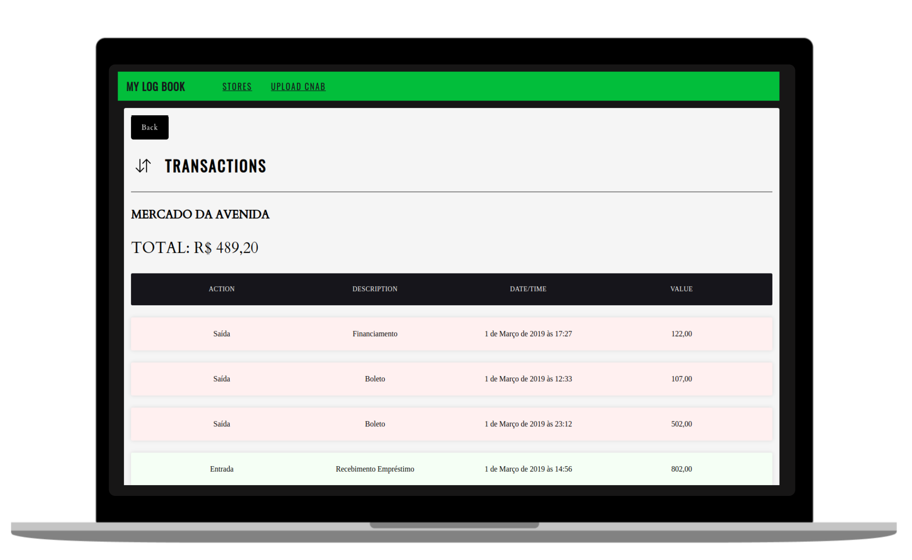
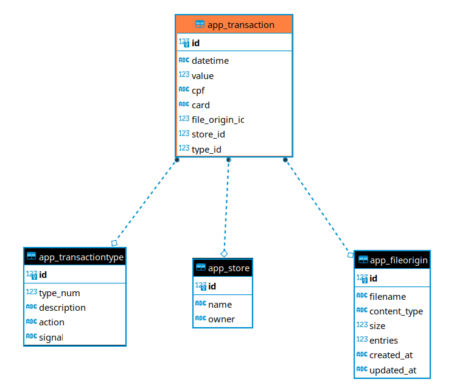

# My Log Book

<p align="center">
  
</p>

---

<h6 align="center">
An app for tracking financial transactions :smile:
</h6>

### Get repo
```
git clone https://github.com/cardosorrenan/desafio-dev
```

# Install steps


## 1º Option - Docker
---

#### 1.1 - Run docker compose
```
cd my_logbook
```

#### 1.2 - Run docker compose
```
docker-compose up --build -d
```

- http://localhost:8000

## 2º Option - Local (Standard)
---
#### Pre-requirements
```
Python 3
Pip
Postgres
```

### 2.1 - Setup Database
---

#### 1.1.2 - Accessing postgres via command-line
```
sudo -i -u postgres

psql
```

#### 1.1.3 - Creating Database and User
```
CREATE DATABASE mylogbook;

CREATE USER mylogbook_user WITH ENCRYPTED PASSWORD 'mylogbook_pass';

GRANT ALL PRIVILEGES ON DATABASE mylogbook TO mylogbook;
```

#### 1.1.4 - User permit create database for tests
```
ALTER USER mylogbook_user CREATEDB;

exit;
```

### 1.2 - Setup Application
---
#### 1.2.1 - Open app folder after download repo
```
cd my_logbook
```

#### 1.2.2 - Install virtual environment (venv)
```
pip install virtuaenv
```

#### 1.2.3 - Create a venv 'env'
```
python -m venv env
```

#### 1.2.4 - Activate env
```
source env/bin/activate
```

#### 1.2.5 - Install packages
```
pip install -r requirements.txt
```

#### 1.2.6 - Create migrations
```
python manage.py makemigrations
```

#### 1.2.7 - Run migrate
```
python manage.py migrate
```

#### 1.2.8 - Create superuser (dev/tests purposes)
```
./manage.py create_superuser_test --username superuser_test --password 1234 --noinput --email 'superuser@test.com'
```

#### 1.2.9 - Dump data
```
python manage.py loaddata app/fixtures/*.json
```

#### 1.2.10 - Run tests
```
python manage.py test
```

#### 1.2.11 - Run app
```
python manage.py runserver
```

- http://localhost:8000


# API Docs

## Insomnia File
---
<a href="./assets/Insomnia_2022-01-18.json" download>Click to Download</a>

## Relational diagram
---
<p align="center">
  
</p>

## Store
---
```
 Store {
    name: string
    owner: string
 }
 ```

 | | URL | METHOD | BODY | RESPONSE |
 | :-: | :-: | :-: | :-: | :-: |
 | INDEX | /api/v1/store | GET | - | Store[ ] |
 | GET ONE | /api/v1/store/{id} | GET | - | Store |
 | GET AMOUNT | /api/v1/store/{id}/amount | GET | - | id,<br /> amount |
 | CREATE | /api/v1/store | POST | Store | Store |
 | EDIT | /api/v1/store/{id} | PATCH | Store | Store |
 | DELETE | /api/v1/store/{id} | DELETE | - | - |


## Transaction
---
```
 Transaction {
    file_origin = int
    type = int
    store = int
    datetime = datetime
    value = decimal
    cpf = string
    card = string
 }
 ```

 | | URL | METHOD | BODY | RESPONSE |
 | :-: | :-: | :-: | :-: | :-: |
 | INDEX | /api/v1/transaction | GET | - | Transaction[ ] |
 | GET ONE | /api/v1/transaction/{id} | GET | - | Transaction |
 | CREATE | /api/v1/transaction | POST | Transaction | Transaction |
 | EDIT | /api/v1/transaction/{id} | PATCH | Transaction | Transaction |
 | DELETE | /api/v1/transaction/{id} | DELETE | - | - |

## File Origin (Uploads)
---
```
 FileOrigin {
    filename = string
    content_type = string
    size = float
    entries = int
    created_at = datetime
    updated_at = datetime
 }
 
 
 ```

 | | URL | METHOD | BODY | RESPONSE |
 | :-: | :-: | :-: | :-: | :-: |
 | INDEX | /api/v1/file_origin | GET | - | FileOrigin[ ] |
 | GET ONE | /api/v1/file_origin/{id} | GET | - | FileOrigin |

## Oauth
---

### GET: /o/token
```
REQUEST
{
    "client_secret": "client_secret_test", 
    "client_id": "client_id_test", 
    "grant_type": "password",
    "username": "superuser_test", 
    "password": "1234"
}

RESPONSE
{
  "access_token": "wS4W3gUdlL2KdMcCQHQBf7W0pTO4sR",
  "expires_in": 36000,
  "token_type": "Bearer",
  "scope": "read write",
  "refresh_token": "jUsEidWSHx2lWSKnCZkZ9juAWsWmxy"
}
```

### GET: /o/revoke_token
```
REQUEST
{
	"client_secret": "client_secret_test", 
	"client_id": "client_id_test", 
	"token": "wS4W3gUdlL2KdMcCQHQBf7W0pTO4sR"
}

RESPONSE
200
```